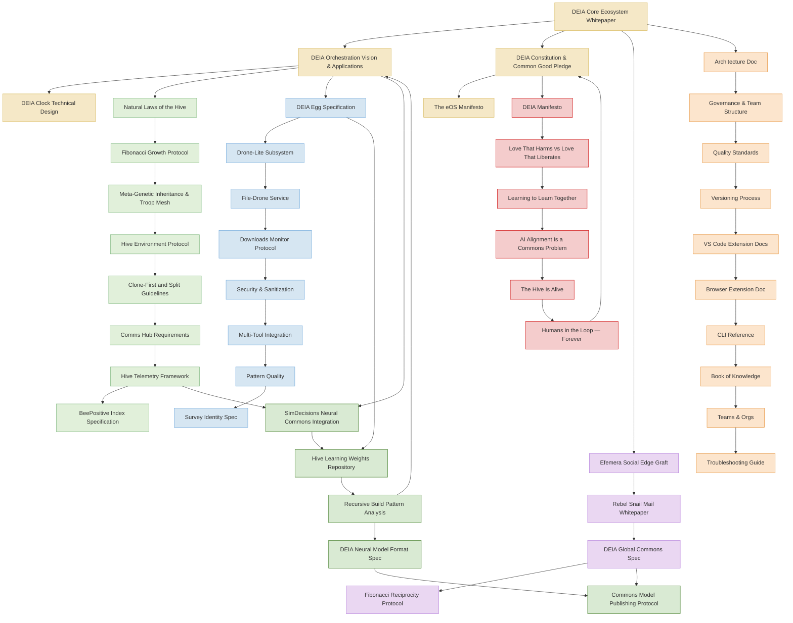

```mermaid
graph TD
  %% Core Ecosystem
  A1[DEIA Core Ecosystem Whitepaper] --> A2[DEIA Orchestration Vision & Applications]
  A2 --> A3[DEIA Clock Technical Design]
  A1 --> A4[DEIA Constitution & Common Good Pledge]
  A4 --> A5[The eOS Manifesto]

  %% Hive Protocol
  A2 --> B1[Natural Laws of the Hive]
  B1 --> B2[Fibonacci Growth Protocol]
  B2 --> B3[Meta-Genetic Inheritance & Troop Mesh]
  B3 --> B4[Hive Environment Protocol]
  B4 --> B5[Clone-First and Split Guidelines]
  B5 --> B6[Comms Hub Requirements]
  B6 --> B7[Hive Telemetry Framework]
  B7 --> B8[BeePositive Index Specification]

  %% Eggs, Drones, Tools
  A2 --> C1[DEIA Egg Specification]
  C1 --> C2[Drone-Lite Subsystem]
  C2 --> C3[File-Drone Service]
  C3 --> C4[Downloads Monitor Protocol]
  C4 --> C5[Security & Sanitization]
  C5 --> C6[Multi-Tool Integration]
  C6 --> C7[Pattern Quality]
  C7 --> C8[Survey Identity Spec]

  %% Global Commons
  A1 --> D1[Efemera Social Edge Graft]
  D1 --> D2[Rebel Snail Mail Whitepaper]
  D2 --> D3[DEIA Global Commons Spec]
  D3 --> D4[Fibonacci Reciprocity Protocol]

  %% System Architecture
  A1 --> E1[Architecture Doc]
  E1 --> E2[Governance & Team Structure]
  E2 --> E3[Quality Standards]
  E3 --> E4[Versioning Process]
  E4 --> E5[VS Code Extension Docs]
  E5 --> E6[Browser Extension Doc]
  E6 --> E7[CLI Reference]
  E7 --> E8[Book of Knowledge]
  E8 --> E9[Teams & Orgs]
  E9 --> E10[Troubleshooting Guide]

  %% Manifestos & Essays
  A4 --> F1[DEIA Manifesto]
  F1 --> F2[Love That Harms vs Love That Liberates]
  F2 --> F3[Learning to Learn Together]
  F3 --> F4[AI Alignment Is a Commons Problem]
  F4 --> F5[The Hive Is Alive]
  F5 --> F6[Humans in the Loop — Forever]

  %% Neural & Recursive Learning
  A2 --> G1[SimDecisions Neural Commons Integration]
  G1 --> G2[Hive Learning Weights Repository]
  G2 --> G3[Recursive Build Pattern Analysis]
  G3 --> G4[DEIA Neural Model Format Spec]
  G4 --> G5[Commons Model Publishing Protocol]

  %% Cross-links (feedback loops)
  G3 --> A2
  B7 --> G1
  C1 --> G2
  D3 --> G5
  F6 --> A4

  classDef core fill:#F5E8C7,stroke:#D6B656,stroke-width:1px;
  classDef hive fill:#E1F0DA,stroke:#7FB77E,stroke-width:1px;
  classDef tools fill:#D6E6F2,stroke:#6FA8DC,stroke-width:1px;
  classDef commons fill:#EAD7F2,stroke:#B57EDC,stroke-width:1px;
  classDef system fill:#FCE5CD,stroke:#E69138,stroke-width:1px;
  classDef essays fill:#F4CCCC,stroke:#CC0000,stroke-width:1px;
  classDef neural fill:#D9EAD3,stroke:#38761D,stroke-width:1px;

  class A1,A2,A3,A4,A5 core;
  class B1,B2,B3,B4,B5,B6,B7,B8 hive;
  class C1,C2,C3,C4,C5,C6,C7,C8 tools;
  class D1,D2,D3,D4 commons;
  class E1,E2,E3,E4,E5,E6,E7,E8,E9,E10 system;
  class F1,F2,F3,F4,F5,F6 essays;
  class G1,G2,G3,G4,G5 neural;
```

